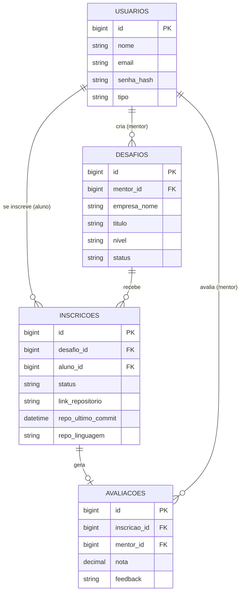

# Trampolim — plataforma de desafios práticos
*(nome provisório, mudem à vontade — v2, revisado após discussão do time e checado contra os critérios oficiais do +praTi/Codifica)*

> Conecta aluno e mentor através de desafios reais. O aluno resolve, recebe avaliação de um mentor, e isso constrói um portfólio público validado — que qualquer empresa/RH pode acessar sem precisar de login. Portfólio e vitrine de vagas ao mesmo tempo.

Baseado na proposta que o Luciano trouxe pro grupo em 01/08, revisada com pontos importantes do time (simplificação do público-alvo, stack e APIs externas) e conferida contra o documento oficial "Critérios de Continuidade e Avaliação — Trilha Dev. Full Stack 2026".

## O que mudou da v1 pra v2

- **Público-alvo**: era aluno/mentor/empresa (3 perfis logados) → agora é só **aluno e mentor**. O valor pra empresa continua existindo (perfil público do aluno, com nota de terceiro validando o portfólio), só que sem precisar de conta/dashboard de empresa.
- **Stack de back-end**: **Java + Spring Boot** — isso não é só preferência das empresas mantenedoras, é requisito oficial do critério de avaliação.
- **Front-end**: **React puro, sem alternativa** — o critério oficial exige ReactJS especificamente, então a opção de "JS puro" foi removida daqui.
- **APIs externas**: GitHub API (valida o envio do projeto) e um serviço de e-mail (notificações).
- **Nova tela**: Home/landing page, antes do login.
- **Testes e documentação**: adicionados como seções próprias, exigidos pelo critério oficial (ver abaixo).

## Funcionalidades principais

- **Home** — landing page explicando o propósito da plataforma, com call-to-action pro cadastro
- **Autenticação** — cadastro e login para 2 perfis: aluno e mentor
- **Desafios** — mentor cria, edita e fecha desafios (título, descrição, tecnologias, nível, prazo, e opcionalmente "em nome de" uma empresa, como texto livre)
- **Inscrição e envio** — aluno se inscreve num desafio e envia o link do repositório; o back-end consulta a API do GitHub pra confirmar que o repositório existe, pegar a data do último commit e a linguagem principal
- **Avaliação** — mentor avalia o envio com nota e feedback escrito; o aluno recebe um e-mail avisando
- **Perfil do aluno** — página pública (sem precisar de login pra ver) com desafios concluídos, notas e links — funciona como portfólio validado por terceiro
- **Painel de métricas** — números agregados: total de desafios, inscrições, taxa de conclusão

## Stack sugerida

- **Front-end:** React — obrigatório pelo critério oficial
- **Back-end:** Java + Spring Boot — obrigatório pelo critério oficial
- **Banco de dados:** MySQL (aceito também PostgreSQL pelo critério)
- **Autenticação:** JWT via Spring Security, senha com hash
- **APIs externas consumidas:**
  - **GitHub API** — valida o link enviado pelo aluno (existe? último commit? linguagem principal?)
  - **Serviço de e-mail** (Resend, SendGrid, ou SMTP simples) — notifica aluno quando avaliado, e mentor quando chega inscrição nova
- **Deploy (quando o MVP estiver pronto):** Render ou Railway pro back, Vercel ou Netlify pro front

## Divisão de tarefas (sugestão)

| Pessoa | Frente | O que faz |
|---|---|---|
| Pelegrino | Banco de dados + API de Desafios | Modelagem SQL, CRUD de desafios em Spring — já tem experiência com Spring desde 2022, líder natural dessa parte |
| Ismael | API de Inscrições e Avaliação + integração GitHub | Regras do fluxo aluno → envio → nota, incluindo a chamada pra API do GitHub |
| João Lucas | Autenticação (Spring Security/JWT) + infraestrutura | Pareado com o Pelegrino no início, já que vem de Python e Java é novidade; depois segue sozinho na parte de Docker/ambiente |
| Luiz | Telas de Desafios | Lista, detalhe e inscrição — já pediu o front |
| Silvia | Telas de Autenticação e Perfil | Cadastro/login e perfil público do aluno |
| Andrius | Tela de Envio do projeto | Tela mais simples, boa pra quem tá começando |
| Rogério | Tela de Avaliação | Pareado com o Ismael pra entender a lógica por trás |
| Luciano | Home/landing page + Painel de métricas + coordenação | Consolida o projeto, acompanha o andamento geral |

A organização por sprints no Trello **já cobre o critério de metodologia ágil** (Scrum/Kanban) — vale só deixar isso explícito na documentação final, citando que o time usou sprints semanais com quadro Kanban.

## Modelo de dados



Imagem separada do diagrama em anexo, pra baixar. 4 tabelas, nada além disso:

```sql
CREATE TABLE usuarios (
  id BIGINT AUTO_INCREMENT PRIMARY KEY,
  nome VARCHAR(120) NOT NULL,
  email VARCHAR(150) NOT NULL UNIQUE,
  senha_hash VARCHAR(255) NOT NULL,
  tipo ENUM('aluno','mentor') NOT NULL,
  bio TEXT,
  github_url VARCHAR(255),
  linkedin_url VARCHAR(255),
  criado_em DATETIME DEFAULT CURRENT_TIMESTAMP
);

CREATE TABLE desafios (
  id BIGINT AUTO_INCREMENT PRIMARY KEY,
  mentor_id BIGINT NOT NULL,
  empresa_nome VARCHAR(150),
  titulo VARCHAR(150) NOT NULL,
  descricao TEXT NOT NULL,
  tecnologias VARCHAR(200),
  nivel ENUM('iniciante','intermediario','avancado') DEFAULT 'iniciante',
  prazo_dias INT DEFAULT 7,
  status ENUM('aberto','fechado') DEFAULT 'aberto',
  criado_em DATETIME DEFAULT CURRENT_TIMESTAMP,
  FOREIGN KEY (mentor_id) REFERENCES usuarios(id)
);

CREATE TABLE inscricoes (
  id BIGINT AUTO_INCREMENT PRIMARY KEY,
  desafio_id BIGINT NOT NULL,
  aluno_id BIGINT NOT NULL,
  status ENUM('inscrito','enviado','avaliado') DEFAULT 'inscrito',
  link_repositorio VARCHAR(255),
  repo_ultimo_commit DATETIME,
  repo_linguagem VARCHAR(60),
  data_inscricao DATETIME DEFAULT CURRENT_TIMESTAMP,
  data_envio DATETIME,
  FOREIGN KEY (desafio_id) REFERENCES desafios(id),
  FOREIGN KEY (aluno_id) REFERENCES usuarios(id)
);

CREATE TABLE avaliacoes (
  id BIGINT AUTO_INCREMENT PRIMARY KEY,
  inscricao_id BIGINT NOT NULL,
  mentor_id BIGINT NOT NULL,
  nota DECIMAL(3,1),
  feedback TEXT,
  data_avaliacao DATETIME DEFAULT CURRENT_TIMESTAMP,
  FOREIGN KEY (inscricao_id) REFERENCES inscricoes(id),
  FOREIGN KEY (mentor_id) REFERENCES usuarios(id)
);
```

`repo_ultimo_commit` e `repo_linguagem` são preenchidos automaticamente pela chamada à API do GitHub no momento do envio. O painel de métricas não precisa de tabela própria — dá pra calcular com `COUNT`/`AVG` direto em cima dessas quatro.

## Rotas da API

| Método | Rota | Descrição | Quem acessa |
|---|---|---|---|
| POST | /api/auth/cadastro | Cria conta (aluno ou mentor) | Todos |
| POST | /api/auth/login | Autentica, retorna token | Todos |
| GET | /api/desafios | Lista desafios (filtro por tecnologia/nível) | Todos |
| GET | /api/desafios/:id | Detalhe de um desafio | Todos |
| POST | /api/desafios | Cria desafio | Mentor |
| PUT | /api/desafios/:id | Edita desafio | Mentor |
| DELETE | /api/desafios/:id | Fecha/remove desafio | Mentor |
| POST | /api/desafios/:id/inscricao | Aluno se inscreve | Aluno |
| PUT | /api/inscricoes/:id/envio | Envia link do repositório (consulta a API do GitHub) | Aluno |
| GET | /api/inscricoes?aluno_id= | Lista inscrições de um aluno | Aluno/mentor |
| POST | /api/inscricoes/:id/avaliacao | Avalia com nota + feedback (dispara e-mail) | Mentor |
| GET | /api/usuarios/:id | Perfil público | Todos (sem login) |
| PUT | /api/usuarios/:id | Edita perfil | Dono do perfil |
| GET | /api/metricas | Números agregados pro painel | Todos |

Critério oficial pede tratamento de erro e respostas claras em cada endpoint: usar status HTTP correto (400 dado inválido, 401 sem autenticação, 403 sem permissão, 404 não encontrado) e um formato consistente de mensagem de erro em todas as rotas.

## Testes

O critério oficial exige **cobertura mínima de 70%**, com **JUnit** no back e **Jest** no front, cobrindo pelo menos as operações de CRUD e a autenticação. Não dá pra deixar pro fim do projeto — cada um escreve o teste junto com a funcionalidade que entregar, não depois:

- **Back-end (JUnit):** um teste por endpoint principal — criar/listar desafio, se inscrever, enviar, avaliar, autenticar
- **Front-end (Jest):** teste dos componentes principais e dos fluxos de formulário (cadastro, criação de desafio, envio)
- Configurar as duas ferramentas já no Sprint 1, antes de qualquer feature, pra virar hábito desde o início

## Documentação técnica exigida (README)

O critério pede um README com 4 partes específicas. Melhor ir preenchendo aos poucos:

1. **Instruções de execução local** — passo a passo pra rodar o projeto (o card de "configurar ambiente local" já vira a base disso)
2. **Arquitetura** — como front, back e banco se conversam (o modelo de dados e as rotas da API deste documento já cobrem a base)
3. **Funcionalidades implementadas** — o que cada tela/rota faz (a seção "Funcionalidades principais" daqui serve de rascunho)
4. **Aspectos relevantes** — desafios técnicos, decisões de design (por exemplo: por que aluno/mentor em vez de 3 perfis, por que Java+Spring, por que validar com a API do GitHub)

## As 9 telas

Wireframe completo mandado no grupo. Resumo de cada uma:

1. **Home** — landing page explicando o propósito, call-to-action pro cadastro
2. **Login/cadastro** — escolhe o perfil (aluno/mentor), e-mail e senha
3. **Lista de desafios** — busca/filtro + cards com título e tecnologia
4. **Detalhe do desafio** — descrição completa + botão de inscrição
5. **Envio do projeto** — campo pra colar o link do repositório
6. **Criar desafio** — formulário pro mentor publicar (com campo opcional de empresa)
7. **Avaliar envio** — nota + campo de feedback pro mentor
8. **Perfil do aluno** — desafios concluídos, notas, links — público, sem login
9. **Painel de métricas** — números de participação e conclusão

## Próximos passos

- Validar essa versão revisada com o restante do grupo
- Criar o repositório **público** no GitHub (é critério de avaliação) e dar acesso a todo mundo
- Cada um configura o ambiente local (Java + Maven/Gradle + MySQL) — primeiro card no Trello
- Configurar JUnit e Jest desde o Sprint 1
- Definir prazos por etapa: autenticação → desafios → inscrição/envio → avaliação → perfil/painel
- Marcar uma call rápida (o Discord já existe) só pra alinhar dúvidas técnicas antes de começar a codar
